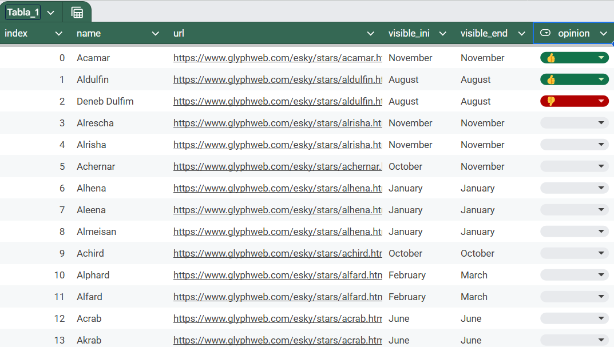

# 🌟 Getting Star Names with Web Scraping 🌟  

Recently, I came across the star catalog on [eSky](https://www.glyphweb.com/esky/stars/), and after exploring it, I liked the idea of using those names for a personal hobby—worldbuilding for my DnD campaign. However, not all of them were valid names, and I wanted to gather additional information, such as the months they are visible in the sky. Manually writing down all this information would have been a lengthy process.  

To simplify the task, I decided to create a web scraping project that extracts star data and saves it in a CSV file. This CSV can later be imported into an Excel file to categorize the names as valid or not.  

Additionally, this project serves as a template for web scraping. It uses the Python libraries `requests` and `bs4` to fetch and parse the HTML content, and `pandas` to save the extracted data into a CSV file. The process consists of the following main steps:  

1. Requesting the HTML code of the star catalog.  
2. Extracting the URLs of all stars.  
3. Requesting the HTML code for each specific star.  
4. Extracting all possible names for the star and the months it is visible (if available).  

### Challenges and Solutions  

Some key challenges in this project included:  

- **Duplicate entries**: The catalog contains multiple instances of the same star (same URL) but under different names. To avoid redundant requests, the script checks if the name has already been processed before fetching data from the star’s URL.  
- **Inconsistent webpage structures**:  
  - Some pages use a table-like structure, such as [Acamar Star](https://www.glyphweb.com/esky/stars/acamar.html), while others do not, like [Acubens Star](https://www.glyphweb.com/esky/stars/acubens.html). Fortunately, if the information is tabulated, it is located within HTML elements of the class `"factboxValue"`, which allows differentiation between the two formats.  
  - Some stars with a table structure are missing the "Optimum Visibility" months. In these cases, the script checks for the presence of this section before extracting data.  

This project provides a practical example of web scraping and may be useful for similar data collection tasks. 🚀  

The result as an Excel table is:

